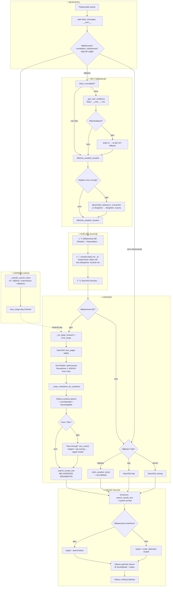

# Magyar Modell Router (LexyChatV2) – működés

## Ábra: a teljes folyamat

---

## Rövid magyarázat lépésről lépésre

### 1. Bejövetel
- A **pipe(body, __user__)** megkapja az üzeneteket és opcionálisan a felhasználó adatait (profil, hely).
- Kiderül, hogy **mélykeresés** kell-e: ha a mondatban van „mélykeresés” (vagy BE van kapcsolva), akkor **use_deep = True**.

### 2. Szándék (Intent)
- **\_classify_search_intent(msg)** eldönti: **hír** / **időjárás** / **tudományos** / **általános**.
- Híreknél a mélykeresés **time_range=day**-t ad a SearXNG-nek → frissebb találatok.

### 3. Hely (csak időjárásnál)
- Ha a kérés **időjárás** („milyen idö lesz ma”): kell egy **hely**.
- **Van hely a mondatban** (pl. „Oberndorf bei Salzburg”) → azt használjuk.
- **Nincs hely** → tartózkodási hely: body / __user__ (location, city), majd **USER_WEATHER_LOCATION**, majd ha még Budapest → **ipapi.co**, ha az nem ad eredményt → **ip-api.com** fallback (IP alapú hely).
- **Hely-egyértelműsítés:** ha a helyben nincs ország (pl. csak „Bergheim”), a **WEATHER_DEFAULT_COUNTRY** (pl. Austria) hozzáfűzése → „Bergheim, Austria” (pontosabb Meteoblue/Bergfex scrape).
- A **„ma”** szó nem hely, ezért nem adunk vissza „ma”-t helyként.

### 4. Kijelzés (sorrend)
1. **🔍 Mélykeresés BE (Reader) – folyamatban…** (vagy KI, ha egyszerű keresés).
2. **📍 [mondat] (hely) ma** – időjárásnál mindig kiírjuk a helyet (pl. *melykeresés milyen idö lesz (Bergheim, Austria) ma*).
3. **🔍 SearXNG keresés…** – ezután indul a tényleges keresés.

### 5. Keresés – két ág

**Mélykeresés BE (use_deep):**
- **SearXNG**: max **MAX_DEEP_RESEARCH_PAGES** (default 10) találat; híreknél **time_range=day**.
- **Jina Reader**: lapok **párhuzamosan** (Semaphore 3), 3500 kar/lap. **403/429** esetén nincs retry; egyéb rövid válasznál 30 s retry.
- **\_clean_markdown_for_synthesis**: navigáció/lábléc/cookie minták csökkentése a kontextusablak és a szintézis gyorsításához.
- **Ollama szintézis (qwen3)**: a lapok szövegéből összefoglaló (💭 Gondolkodás + Összefoglalás).
- Ha a lekérdezés weather/forecast → a szintézis prompt kiemeli: **időjárás**, nem óra.
- **Pass-through:** ha a szintézis üres vagy sikertelen, a **raw_context** (snippet + lap szöveg) kerül közvetlenül a végső modell elé → **search_results_text** (MÉLYKERESÉS EREDMÉNYEI vagy NYERS FORRÁSOK).

**Mélykeresés KI (egyszerű):**
- **Időjárás** → _fetch_weather_direct (Meteoblue/Bergfex scrape), ha üres → 1 lap Jina (Meteoblue).
- **Képkeresés** → SearXNG kép.
- **Egyéb** → SearXNG szöveg, opcionálisan Jina a top 2–3 lapra.

### 6. Dátum
- **Ma** = **WEATHER_TZ** vagy **TZ** (pl. Europe/Budapest, Europe/Vienna). Ha nincs beállítva → **Europe/Budapest**, ne UTC.

### 7. Végső válasz
- **Kontextus** = system prompt (magyar, időjárás/hír utasítások) + **search_results_text** + üzenetek.
- Ha a kontextus **mélykeresés** eredmény (MÉLYKERESÉS / NYERS FORRÁSOK / „Mélykeresés lefutott”) → **target = qwen3:latest**.
- Egyébként a **router** választ modellt (pl. SambaLingo, qwen3).
- **Ollama /api/chat** stream: ⏳ Gondolkodik + válasz (think API ha qwen3).

---

## Összefoglaló táblázat

| Elem            | Szerepe |
|-----------------|--------|
| **SearXNG**     | Webes keresés (találatok + URL-ek). |
| **Jina Reader** | Lapok szövegének kinyerése (LLM-barát markdown). |
| **Ollama szintézis** | Mélykeresés: 10 lap → egy összefoglaló (qwen3). |
| **Ollama végső**    | A felhasználónak szóló válasz (qwen3 vagy router modell). |
| **effective_weather_location** | Időjárás helye: mondat / profil / env / IP. |
| **WEATHER_TZ**  | „Ma” dátum időzónája (alap: Europe/Budapest). |
| **WEATHER_DEFAULT_COUNTRY** | Ország hely-egyértelműsítéshez, ha a mondatban nincs (pl. Bergheim → Austria). |
| **MAX_DEEP_RESEARCH_PAGES** | Mélykeresés lapok max száma (default 10). |
| **Intent + time_range** | Híreknél SearXNG time_range=day. |

---

*Fájl: model_router_simple.py (Magyar Modell Router).*
